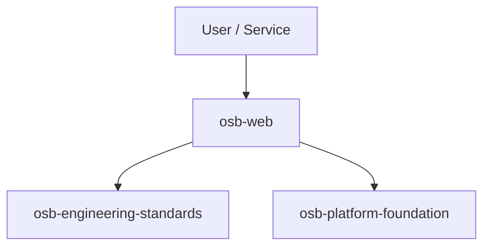

# Architecture - osb-web

## Overview
Next.js public web, academy portal, learner dashboard and PWA. This repository is part of the OmSaravanaBhava Learning Ecosystem Enterprise Architecture v1.0.

## Context diagram

## Architecture principles
- Secure by default
- Observable by default
- API-first where applicable
- Documentation-as-code
- ADR-controlled change

## Dependencies
See `ROADMAP.md` for implementation sequence and dependency notes.
